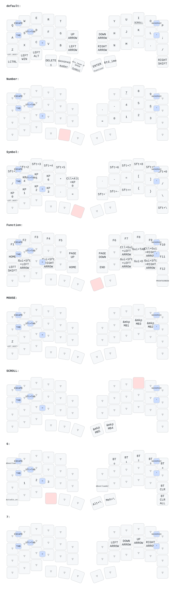

# zmk-config-roBa

## DYA Studio（実験的対応）

[DYA開発ガイド](https://studio.dya.cormoran.works/developer-guide/level-2)に合わせ、
ZMK `main+dya`・Zephyr 4.1系・DYAモジュールの2026-09-22確認時点の最新コミットへ固定しています。
ボード名は `xiao_ble//zmk` です。依存の具体的なSHAは `config/west.yml` に記載しています。
DYA導入前の構成は `pre-dya-studio` ブランチに保存しています。

左右のファームウェアをビルドして書き込み、右側をUSB接続して
[DYA Studio](https://studio.dya.cormoran.works/)から接続します。
BLE管理・共通設定RPC・高速キーマップ取得・マウス／スクロール感度調整・PMW3610のCPIや省電力設定のRPCを有効にしています。
バッテリー履歴は無効です。任意のRuntime Macro / Combo・OS検出・診断モジュールは追加していません。

- 通常のキー配置、レイヤー7のHJKL矢印、既存のポインター加速設定を維持しています。
- 自動マウスレイヤーはDYA標準のTemp-Layerへ移行しています。
  元の設定に合わせ、レイヤー4・入力後の有効化抑制300msにしています。DYAの `mouse` 設定から変更できます。
  無操作解除は元の100,000msから、DYA内部の16bit値で表現できる最大の65,535msへ変更しています。
  クリック・修飾キーでは解除しない構成です。Shift/Zはマウスレイヤーにも明示して維持しています。
  通常キーは透過にし、解除判定をDYAに任せています。旧方式の移動量閾値10・蓄積リセット200msはDYA標準では再現できません。
- DYAの `mouse` 感度調整は既存の加速処理の後に適用されます。
  センサーCPIの初期値は400です。DYA側で変更する場合、既存加速処理の `sensor-dpi` は自動では追従しません。
- レイヤー5のスクロールはDYAの `scroll` 処理へ移行しています。
  初期倍率は1/16ですが、旧ドライバーとは端数処理・斜めスクロールの挙動が異なります。
- ドライバー変更後のポインター方向・速度、スクロール、設定保存は実機確認が必要です。
